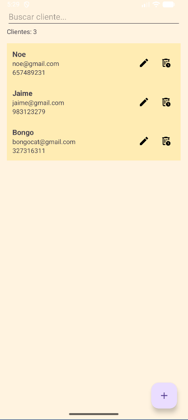
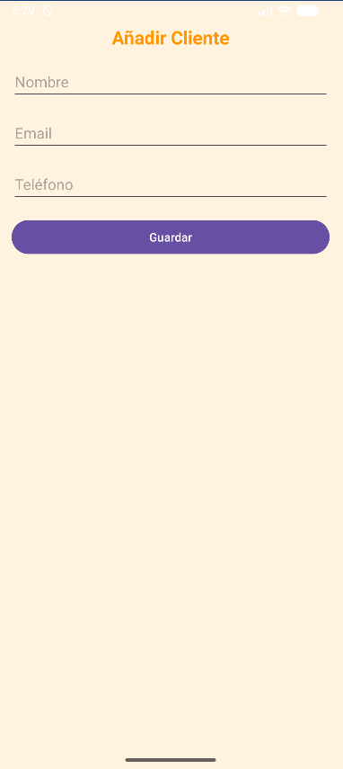

# Gestor de Clientes - App CRM Android

Esta aplicación móvil permite registrar, gestionar, buscar, editar y borrar clientes, simulando un pequeño CRM para empresas.

---

## Funcionalidades principales

- CRUD completo: Crear, Leer, Actualizar y Borrar clientes.
- Persistencia local usando SQLite a través de la clase `ClienteDBHelper`.
- Interfaz con RecyclerView y Adapter personalizado para mostrar clientes.
- Búsqueda en tiempo real con filtro por nombre.
- Contador dinámico de clientes visibles.
- Confirmación para borrar clientes.
- Formulario de cliente con validaciones (nombre obligatorio, email válido, teléfono mínimo 9 dígitos).
- Diseño más agradable con paleta de colores personalizada.

---

## Instrucciones para correr la app

1. Clona o descarga el proyecto.
2. Ábrelo con Android Studio.
3. Ejecuta la app en un emulador o dispositivo físico con Android 8.0 (API 26) o superior.
4. Usa el botón + para añadir clientes.
5. Usa los iconos de lápiz y papelera para editar/borrar.
6. Explora el buscador para filtrar clientes.

---

## Modelo de datos

La tabla `clientes` contiene:

| Campo    | Tipo      | Detalles                     |
| -------- | --------- | ---------------------------- |
| id       | INTEGER   | Clave primaria autoincremental |
| nombre   | TEXT      | Nombre completo del cliente  |
| email    | TEXT      | Email válido del cliente     |
| telefono | TEXT      | Número de teléfono (mín. 9 dígitos) |

---

## Capturas de pantalla

##Pantalla pricipal donde salen los clientes después de ser añadidos

##Formulario que sale cuando añades o editas algun cliente

---

## Autor

Daniel - 2º DAM

---

## Notas finales

Este proyecto representa un ejemplo completo de gestión básica de clientes en Android, cubriendo conceptos clave del desarrollo móvil: bases de datos locales, adaptación de interfaces y manejo del ciclo de vida.

